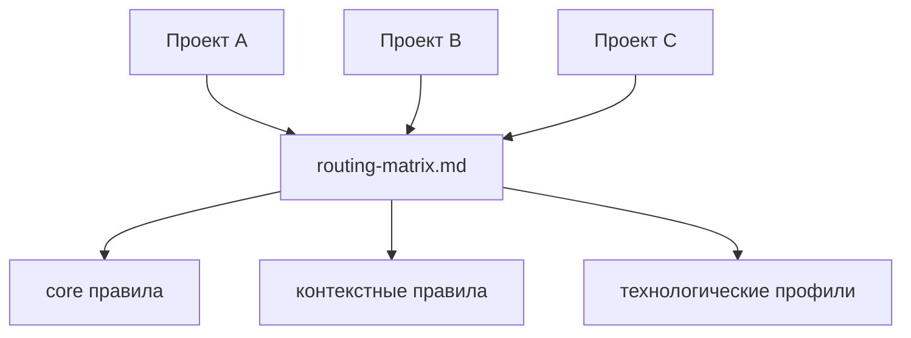

# Agents.md

**Централизованная система инструкций для AI-агентов разработки.**

Перестаньте копировать `AGENTS.md` в каждый репозиторий.

Вместо этого:

* храните инструкции для агентов **в одном месте**
* подключайте их из проектов
* обновляйте правила **один раз → применяются везде**

Проще говоря:

> `Agents.md` — это **`.editorconfig` для AI-агентов**.

---

# Зачем это нужно

При использовании AI-агентов (Codex, Cursor, Claude Code, Copilot и др.)
в проектах обычно появляется файл `AGENTS.md` с правилами работы:

* правила коммитов
* требования к тестам
* правила отладки
* архитектурные ограничения

Со временем возникает проблема:

```
один файл
в 10 репозиториях
с 10 разными версиями
```

Изменение правил превращается в боль.

Этот репозиторий решает проблему с помощью
**централизованного каталога инструкций для агентов**.

---

# Общая архитектура

Проекты **не дублируют инструкции**, а ссылаются на центральный каталог.



---

# Структура репозитория

```
instructions/
 ├─ core/          # базовые правила
 │
 ├─ contexts/      # контексты выполнения
 │   ├─ debug
 │   ├─ testing
 │   ├─ performance
 │   └─ visual-feedback
 │
 ├─ profiles/      # технологические профили
 │
 ├─ governance/    # правила маршрутизации и политики
 │   ├─ routing-matrix.md
 │   ├─ versioning-policy.md
 │   └─ document-contract.md
 │
 └─ onboarding/    # шаблоны подключения

scripts/           # валидация инструкций
specs/             # шаблоны спецификаций
```

---

# Канонические точки входа

Основные файлы системы:

* `AGENTS.md` — основная точка входа
* `instructions/governance/routing-matrix.md` — алгоритм маршрутизации инструкций
* `instructions/core/quest-governance.md` — gate `SPEC → EXEC` для инженерных изменений

---

# Как работает маршрутизация инструкций

Агент загружает инструкции в следующем порядке:

```
core → context → profile → governance
```

Алгоритм работы:

1. Прочитать `AGENTS.md`
2. Открыть `routing-matrix.md`
3. Определить тип задачи
4. Собрать стек инструкций

---

# Быстрый старт

## 1. Склонировать каталог инструкций

```
git clone https://github.com/Kibnet/Agents.md.git .agents
```

---

## 2. Подключить его к проекту

Создайте в своём репозитории файл `AGENTS.md`:

```
# AGENTS

Основные инструкции для агента находятся здесь:

../.agents/AGENTS.md
```

Теперь агент будет читать правила из общего каталога.

---

# Локальные переопределения

Если проекту нужны дополнительные ограничения, можно создать:

```
AGENTS.override.md
```

В нём можно добавить **локальные правила**,
не дублируя весь набор инструкций.

---

# Проверка качества

Перед завершением изменений можно запустить валидацию:

```
pwsh -File scripts/validate-instructions.ps1
pwsh -File scripts/test-validate-instructions.ps1
```

---

# CI-валидация

В репозитории настроен workflow:

```
.github/workflows/validate-instructions.yml
```

Он проверяет инструкции при:

* `push`
* `pull request`

---

# Поддерживаемые AI-инструменты

Каталог рассчитан на использование с агентами, которые читают `AGENTS.md`, например:

* Codex CLI
* Cursor
* Claude Code
* GitHub Copilot Agents
* Windsurf

---

# Философия проекта

Цели:

* единый каталог инструкций для AI-агентов
* повторное использование правил между репозиториями
* единый инженерный workflow
* версионирование и управление правилами

---

# Участие в развитии

Приветствуются улучшения:

* алгоритма маршрутизации
* технологических профилей
* контекстных инструкций
* скриптов валидации

---

# Лицензия

MIT
