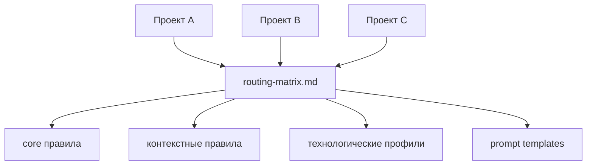

# Agents.md

**Централизованная система инструкций для AI-агентов разработки.**

Перестаньте копировать `AGENTS.md` в каждый репозиторий.

Вместо этого:

* храните инструкции для агентов **в одном месте**
* подключайте их из проектов
* обновляйте правила **один раз → применяются везде**

Проще говоря:

> `Agents.md` — это **`.editorconfig` для AI-агентов**.

---

# Зачем это нужно

При использовании AI-агентов (Codex, Cursor, Claude Code, Copilot и др.)
в проектах обычно появляется файл `AGENTS.md` с правилами работы:

* правила коммитов
* требования к тестам
* правила отладки
* архитектурные ограничения

Со временем возникает проблема:

```
один файл
в 10 репозиториях
с 10 разными версиями
```

Изменение правил превращается в боль.

Этот репозиторий решает проблему с помощью
**централизованного каталога инструкций для агентов**.

---

# Общая архитектура

Проекты **не дублируют инструкции**, а ссылаются на центральный каталог.
То же правило распространяется на базовый шаблон спеки: canonical `_template.md` живёт в центральном каталоге по отдельному пути `templates/specs/_template.md`, а локальный `specs/` остаётся только каталогом рабочих спецификаций.



---

# Структура репозитория

```
instructions/
 ├─ core/          # базовые правила
 │
 ├─ contexts/      # контексты выполнения
 │   ├─ debug
 │   ├─ testing
 │   ├─ performance
 │   └─ visual-feedback
 │
 ├─ profiles/      # технологические профили
 │
 ├─ governance/    # правила маршрутизации и политики
 │   ├─ routing-matrix.md
 │   ├─ review-loops.md
 │   ├─ versioning-policy.md
 │   └─ document-contract.md
 │
 └─ onboarding/    # шаблоны подключения

prompts/           # канонические prompt templates для guided workflows
 └─ business-process-automation/
                    # интервью -> AS-IS -> точки автоматизации -> TO-BE -> skill graph

scripts/           # валидация инструкций
templates/         # canonical templates
specs/             # рабочие спецификации
```

---

# Канонические точки входа

Основные файлы системы:

* `AGENTS.md` — основная точка входа
* `instructions/governance/routing-matrix.md` — алгоритм маршрутизации инструкций
* `instructions/core/quest-governance.md` — gate `SPEC → EXEC` для инженерных изменений
* `instructions/governance/review-loops.md` — обязательные auto-review loops после `SPEC` и `EXEC`
* `instructions/profiles/business-process-automation.md` — сценарный профиль для пошаговой автоматизации бизнес-процессов

---

# Как работает маршрутизация инструкций

Агент загружает инструкции в следующем порядке:

```
core → context → profile → governance
```

Алгоритм работы:

1. Прочитать `AGENTS.md`
2. Открыть `routing-matrix.md`
3. Определить тип задачи:
   * `catalog-governance`
   * `consumer-onboarding`
   * `delivery-task`
   * `guided-artifact-workflow`
4. Собрать стек инструкций

Важно:

* `SPEC gate` применяется к инженерным изменениям каталога, кода, инфраструктуры и канонических файлов проекта
* внутри `QUEST` после черновика спеки обязателен цикл `draft → lint/rubric → post-review → refine`
* внутри `QUEST` после исполнения обязателен цикл `implement → test → post-review → fix/retest → report`
* если review находит uniquely best option, агент обязан выбрать его сам; пользователя спрашивают только при реальной неоднозначности
* guided workflow с пользовательскими артефактами может идти без `SPEC gate`, если агент не меняет канонические файлы
* для аналитических задач без выраженного стека можно использовать сценарный профиль без `stack profile`

Примеры:

* инженерная задача по каталогу: `quest-governance + collaboration-baseline + governance overlays`
* пошаговый анализ бизнес-процесса: `collaboration-baseline + business-process-automation`

---

# Guided Workflows

Каталог поддерживает не только правила для инженерных изменений, но и готовые сценарии пошаговой аналитической работы.

Сейчас в репозитории есть канонический guided workflow:

* `business-process-automation`

Этот сценарий ведёт агента по цепочке:

1. синтетическое интервью с экспертом
2. моделирование `AS-IS`
3. анализ точек автоматизации
4. проектирование `TO-BE`
5. построение skill graph ИИ-агента

Шаблоны шагов лежат в `prompts/business-process-automation/`.
Если пользователь просит выдавать артефакты по шагам, агент должен сохранять каждый шаг отдельным файлом и ждать подтверждения перед продолжением.

---

# Быстрый старт

## 1. Склонировать каталог инструкций

```
git clone https://github.com/Kibnet/Agents.md.git .agents
```

---

## 2. Подключить его к проекту

Создайте в своём репозитории файл `AGENTS.md`:

```
# AGENTS

Этот репозиторий использует центральный каталог инструкций:

- <AGENTS_ROOT>\AGENTS.md

Для QUEST-задач:

- рабочие spec-файлы создаются в локальном `.\specs\`
- canonical template всегда берётся из `<AGENTS_ROOT>\templates\specs\_template.md`
```

Где `<AGENTS_ROOT>` указывает на каталог с централизованными инструкциями, например:

```
$env:AGENTS_ROOT = "$PWD\.agents"
```

Теперь агент будет читать правила из общего каталога, а для `QUEST` брать canonical spec template из этого же central root по пути `templates/specs/_template.md`.

---

# Локальные переопределения

Если проекту нужны дополнительные ограничения, можно создать:

```
AGENTS.override.md
```

В нём можно добавить **локальные правила**,
не дублируя весь набор инструкций.

---

# Проверка качества

Перед завершением изменений можно запустить валидацию:

```
pwsh -File scripts/validate-instructions.ps1
pwsh -File scripts/test-validate-instructions.ps1
```

---

# CI-валидация

В репозитории настроен workflow:

```
.github/workflows/validate-instructions.yml
```

Он проверяет инструкции при:

* `push`
* `pull request`

---

# Поддерживаемые AI-инструменты

Каталог рассчитан на использование с агентами, которые читают `AGENTS.md`, например:

* Codex CLI
* Cursor
* Claude Code
* GitHub Copilot Agents
* Windsurf

---

# Философия проекта

Цели:

* единый каталог инструкций для AI-агентов
* повторное использование правил между репозиториями
* единый инженерный workflow
* версионирование и управление правилами

---

# Участие в развитии

Приветствуются улучшения:

* алгоритма маршрутизации
* технологических профилей
* контекстных инструкций
* скриптов валидации

---

# Лицензия

MIT
