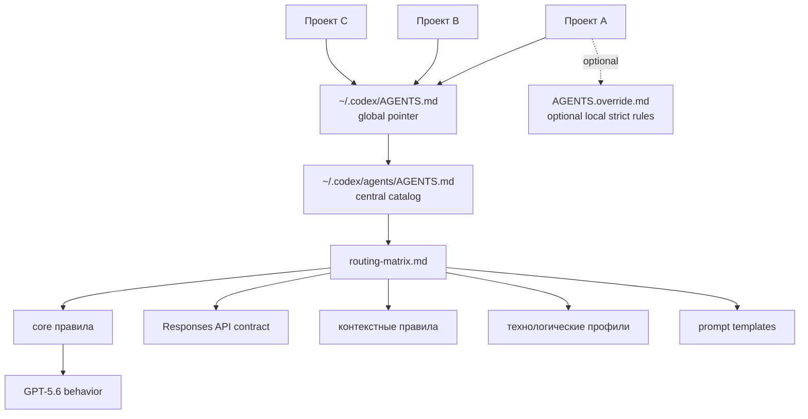

# Agents.md

**Централизованная система инструкций для AI-агентов разработки.**

Перестаньте копировать `AGENTS.md` в каждый репозиторий.

Вместо этого:

* храните инструкции для агентов **в одном месте**
* подключайте их из проектов
* обновляйте правила **один раз → применяются везде**

Проще говоря:

> `Agents.md` — это **`.editorconfig` для AI-агентов**.

---

# Зачем это нужно

При использовании AI-агентов (Codex, Cursor, Claude Code, Copilot и др.)
в проектах обычно появляется файл `AGENTS.md` с правилами работы:

* правила коммитов
* требования к тестам
* правила отладки
* архитектурные ограничения

Со временем возникает проблема:

```
один файл
в 10 репозиториях
с 10 разными версиями
```

Изменение правил превращается в боль.

Этот репозиторий решает проблему с помощью
**централизованного каталога инструкций для агентов**.

---

# Общая архитектура

Основная схема для Codex: один глобальный pointer в `~\.codex\AGENTS.md`
ссылается на центральный каталог `~\.codex\agents\AGENTS.md`.
Рабочие репозитории не дублируют инструкции: локально они добавляют только
`AGENTS.override.md`, если нужны дополнительные строгие правила.

То же правило распространяется на базовый шаблон спеки: canonical `_template.md`
живёт в центральном каталоге по отдельному пути `templates/specs/_template.md`,
а локальный `specs/` остаётся только каталогом рабочих спецификаций.



---

# Surface Contract Matrix для GPT-5.6

Каталог оптимизирован под семейство `GPT-5.6`, но не предполагает одинаковую модель, naming или reasoning controls во всех продуктах. Перед model-sensitive validation фиксируйте фактическую поверхность и выбранный профиль. Snapshot актуализирован 2026-07-14; availability и тарифные ограничения нужно перепроверять перед rollout.

| Поверхность | Текущий контракт | Как использовать каталог |
|---|---|---|
| Standard ChatGPT | `GPT-5.5 Instant` остаётся default; `GPT-5.6 Sol` используется для Medium/High/Extra High, а Sol Pro — для Pro на доступных планах. Terra/Luna здесь не выбираются. | Применять behavior baseline, но не требовать GPT-5.6 для обычного Instant-чата и не переносить API model IDs в product UI. |
| Work в ChatGPT / Codex | В зависимости от плана доступны Sol/Terra/Luna и reasoning controls; Codex Ultra означает multi-agent execution, а не API `reasoning.mode: "pro"`. | Фиксировать фактически выбранные model/tier/effort. Для воспроизводимых CLI smoke предпочитать явный tier, например `gpt-5.6-sol`; alias проверять в текущей account/runtime среде. |
| OpenAI API | Доступны `gpt-5.6-sol`, `gpt-5.6-terra`, `gpt-5.6-luna`; API alias `gpt-5.6` направляет на Sol. Reasoning effort и Pro mode задаются API-параметрами. | По API-триггеру подключать `instructions/governance/openai-responses-api.md`; не дублировать его wire-level правила в общем baseline. |

Официальные источники snapshot: [GPT-5.6 in ChatGPT](https://help.openai.com/en/articles/20001354-gpt-56-in-chatgpt/), [ChatGPT Work и Codex models](https://learn.chatgpt.com/docs/models), [OpenAI API model guidance](https://developers.openai.com/api/docs/guides/latest-model).

---

# Структура репозитория

```
instructions/
 ├─ core/          # базовые правила и QUEST owner-документы
 ├─ contexts/      # контексты выполнения
 │   ├─ debug-dotnet-mcp-coreclr.md
 │   ├─ performance-optimization.md
 │   ├─ testing-dotnet.md
 │   ├─ testing-frontend.md
 │   └─ visual-feedback.md
 ├─ profiles/      # технологические и сценарные профили
 ├─ governance/    # routing, quality gate и политики каталога
 └─ onboarding/    # шаблоны подключения

prompts/           # канонические prompt templates для guided workflows
 ├─ business-process-automation/
 └─ storm/

schemas/           # JSON Schema для machine-readable workflow artifacts
scripts/           # валидация инструкций и вспомогательные workflow scripts
 └─ storm/
templates/
 ├─ specs/
 │  └─ _template.md
 └─ storm/
specs/             # рабочие спецификации изменений каталога
```

---

# Канонические точки входа

Основные файлы системы:

* `AGENTS.md` — основная точка входа
* `instructions/governance/routing-matrix.md` — алгоритм маршрутизации инструкций
* `instructions/core/model-behavior-baseline.md` — owner optimization baseline семейства `GPT-5.6`: outcome-first, surface-aware model guidance и stop rules
* `instructions/governance/openai-responses-api.md` — trigger-based owner wire-level контрактов OpenAI Responses API
* `instructions/core/quest-governance.md` — gate `SPEC → EXEC` для инженерных изменений
* `instructions/core/quest-mode.md` — owner фазового поведения `QUEST`
* `instructions/governance/review-loops.md` — обязательные auto-review loops после `SPEC` и `EXEC`
* `instructions/profiles/business-process-automation.md` — сценарный профиль для пошаговой автоматизации бизнес-процессов
* `instructions/profiles/storm-product-development.md` — сценарный профиль для STORM product workflow, BDD/Gherkin behavior layer и команд `/storm:*`

---

# Как работает маршрутизация инструкций

Точный алгоритм выбора документов, порядок сборки stack и модель разрешения конфликтов определены только в [instructions/governance/routing-matrix.md](instructions/governance/routing-matrix.md).

Короткий порядок работы:

1. Прочитать `AGENTS.md`
2. Открыть `routing-matrix.md`
3. Определить тип задачи:
   * `catalog-governance`
   * `consumer-onboarding`
   * `delivery-task`
   * `guided-artifact-workflow`
4. Собрать central stack по `routing-matrix.md`, включая `model-behavior-baseline` как обязательный core baseline для семейства `GPT-5.6`
5. Если в consumer-репозитории есть `AGENTS.override.md`, применить только его ужесточающие правила
6. Если задача идёт через `QUEST`, использовать:
   * [instructions/core/quest-governance.md](instructions/core/quest-governance.md) для applicability и quality gate
   * [instructions/core/quest-mode.md](instructions/core/quest-mode.md) для фазового поведения `SPEC` и `EXEC`

Важно:

* `SPEC gate` применяется к инженерным изменениям каталога, кода, инфраструктуры и канонических файлов проекта
* `model-behavior-baseline` применяется ко всем сценариям и задаёт GPT-5.6 optimization contract: outcome-first цель, surface evidence, критерии успеха, ограничения, output contract и stop rules
* `openai-responses-api` подключается только для API-specific задач; ordinary Markdown review или работа в product UI не должны тянуть wire-level API правила
* на фазе `SPEC` рабочая spec в локальном `./specs/` может обновляться до подтверждения пользователя; остальные файлы менять нельзя
* внутри `QUEST` после черновика спеки обязателен цикл `draft → lint/rubric → post-review → refine`
* внутри `QUEST` после исполнения обязателен цикл `implement → test → post-review → fix/retest → report`
* если review находит uniquely best option, агент обязан выбрать его сам; пользователя спрашивают только при реальной неоднозначности
* guided workflow с пользовательскими артефактами может идти без `SPEC gate`, если агент не меняет канонические файлы
* STORM safe full-cycle может идти как guided workflow только без изменений tests/code/test annotations; любые такие изменения переводят задачу в `delivery-task` с `QUEST`
* STORM BDD/Gherkin команды `/storm:gherkin`, `/storm:bdd-sync`, `/storm:bdd-lint` и `/storm:bdd-conflicts` могут идти как artifact-only guided workflow; `/storm:bdd-implement ST-XXXX` всегда идёт как `delivery-task` через `QUEST`
* для аналитических задач без выраженного стека можно использовать сценарный профиль без `stack profile`

Примеры:

* инженерная задача по каталогу: `model-behavior-baseline + quest-governance + collaboration-baseline + governance overlays`
* пошаговый анализ бизнес-процесса: `model-behavior-baseline + collaboration-baseline + business-process-automation`
* STORM product discovery без code/test mutations: `model-behavior-baseline + collaboration-baseline + storm-product-development`
* STORM implementation/cleanup/test coverage: `model-behavior-baseline + quest-governance + collaboration-baseline + testing-baseline + stack/testing profile + storm-product-development`

---

# Guided Workflows

Каталог поддерживает не только правила для инженерных изменений, но и готовые сценарии пошаговой аналитической работы.

Сейчас в репозитории есть канонические guided workflows:

* `business-process-automation`
* `storm-product-development`

Этот сценарий ведёт агента по цепочке:

1. синтетическое интервью с экспертом
2. моделирование `AS-IS`
3. анализ точек автоматизации
4. проектирование `TO-BE`
5. построение skill graph ИИ-агента

Шаблоны шагов лежат в `prompts/business-process-automation/`.
Если пользователь просит выдавать артефакты по шагам, агент должен сохранять каждый шаг отдельным файлом и ждать подтверждения перед продолжением.

## STORM Product Development

`storm-product-development` ведёт агента по циклу living product specification:

1. восстановить реализованные stories, constraints, tests и code units из текущего продукта;
2. построить traceability `story -> acceptance criteria -> tests -> code`;
3. сформировать Gherkin Rules/Scenarios как executable behavior examples;
4. вывести needs, Product Goal и Product Vision;
5. найти gaps, cloud conflicts и proposed backlog;
6. построить dependency-aware ranking;
7. провести process audit;
8. реализовывать отдельные stories через SDD/BDD только через `/storm:implement ST-XXXX` или `/storm:bdd-implement ST-XXXX`.

Канонический machine-readable artifact в consumer-репозитории:

```text
docs/product/storm.json
```

`.feature` files по умолчанию лежат в:

```text
features/
```

Если consumer-репозиторий использует другой root, он фиксируется в `metadata.feature_root` внутри `storm.json`.

Central assets:

```text
instructions/profiles/storm-product-development.md
prompts/storm/
templates/storm/
schemas/storm-artifacts.schema.json
scripts/storm/validate-artifacts.py
scripts/storm/rank-backlog.py
```

Примеры вызова:

```text
Используй central stack по AGENTS.md и routing-matrix.md, подключи профиль storm-product-development и выполни /storm:full-cycle.
Не меняй tests, code и test annotations.
```

```text
Используй central stack по AGENTS.md и routing-matrix.md, подключи профиль storm-product-development и выполни /storm:implement ST-0007.
```

```text
Используй central stack по AGENTS.md и routing-matrix.md, подключи профиль storm-product-development и выполни /storm:gherkin ST-0007.
```

```text
Используй central stack по AGENTS.md и routing-matrix.md, подключи профиль storm-product-development и выполни /storm:bdd-lint.
```

Проверка artifacts из consumer-репозитория:

```powershell
python <AGENTS_ROOT>\scripts\storm\validate-artifacts.py .\docs\product\storm.json
python <AGENTS_ROOT>\scripts\storm\rank-backlog.py .\docs\product\storm.json --out .\docs\product\reports\ranking.md
```

BDD/Gherkin слой в `storm.json` хранит metadata and traceability, а сами executable examples должны жить в `.feature` files. Acceptance criteria остаются обзорным readiness contract, Gherkin Rules/Scenarios делают их проверяемыми примерами, automated tests and step definitions исполняют эти примеры.

---

# Быстрый старт

## Основной способ: global pointer в Codex home

Для Codex подключите каталог один раз в `C:\Users\<user>\.codex\`.
Проверенная схема:

* центральный каталог доступен как `C:\Users\<user>\.codex\agents`
* `C:\Users\<user>\.codex\AGENTS.md` содержит короткий pointer на центральный `AGENTS.md`
* в рабочих репозиториях локальный `AGENTS.md` больше не нужен
* локальный `AGENTS.override.md` применяется только поверх central stack и может только ужесточать `MUST`
* для `QUEST` рабочие spec-файлы создаются в локальном `.\specs\`, а canonical template берётся из центрального `templates\specs\_template.md`

### 1. Подключить каталог как `~\.codex\agents`

Если репозиторий уже клонирован в удобном месте, создайте junction:

```powershell
$codexHome = Join-Path $env:USERPROFILE ".codex"
$agentsRepo = "C:\path\to\Agents.md"

New-Item -ItemType Junction `
  -Path (Join-Path $codexHome "agents") `
  -Target $agentsRepo
```

Если удобнее хранить каталог прямо в Codex home:

```powershell
git clone https://github.com/Kibnet/Agents.md.git "$env:USERPROFILE\.codex\agents"
```

---

### 2. Создать глобальный pointer

Создайте `C:\Users\<user>\.codex\AGENTS.md`:

```
# AGENTS (global pointer)

Необходимо использовать центральный каталог инструкций:

- `C:\Users\<user>\.codex\agents\AGENTS.md`

Порядок применения:
1. Центральный `AGENTS.md` -> central stack
2. Локальный `AGENTS.override.md` -> дополнительные локальные инструкции поверх central stack; только ужесточение MUST

Для QUEST-задач:

- рабочие spec-файлы создаются в локальном `.\specs\` репозитория
- canonical template берется из `C:\Users\<user>\.codex\agents\templates\specs\_template.md`
```

### 3. Добавлять только локальные ужесточения

В проектах создавайте `AGENTS.override.md` только если нужны дополнительные
локальные ограничения, команды или профиль по умолчанию. Central stack остаётся
источником правил, а override не заменяет центральный `AGENTS.md`.

## Альтернатива: pointer в конкретном репозитории

Для инструментов, которые не читают `~\.codex\AGENTS.md`, можно оставить
локальный pointer в репозитории-потребителе:

```
# AGENTS

Этот репозиторий использует центральный каталог инструкций:

- <AGENTS_ROOT>\AGENTS.md

Для QUEST-задач:

- рабочие spec-файлы создаются в локальном `.\specs\`
- canonical template всегда берётся из `<AGENTS_ROOT>\templates\specs\_template.md`
```

Где `<AGENTS_ROOT>` указывает на каталог с централизованными инструкциями,
например `$env:USERPROFILE\.codex\agents`.

---

# Локальные переопределения

Если проекту нужны дополнительные ограничения, можно создать:

```
AGENTS.override.md
```

В нём можно добавить **локальные правила**,
не дублируя весь набор инструкций.

---

# Проверка качества

Перед завершением изменений можно запустить валидацию:

```
pwsh -File scripts/validate-instructions.ps1
pwsh -File scripts/test-validate-instructions.ps1
```

---

# CI-валидация

В репозитории настроен workflow:

```
.github/workflows/validate-instructions.yml
```

Он проверяет инструкции при:

* `push`
* `pull request`

---

# Поддерживаемые AI-инструменты

Каталог рассчитан на использование с агентами, которые читают `AGENTS.md`, например:

* Codex CLI
* Cursor
* Claude Code
* GitHub Copilot Agents
* Windsurf

---

# Философия проекта

Цели:

* единый каталог инструкций для AI-агентов
* повторное использование правил между репозиториями
* единый инженерный workflow
* версионирование и управление правилами

---

# Участие в развитии

Приветствуются улучшения:

* алгоритма маршрутизации
* технологических профилей
* контекстных инструкций
* скриптов валидации

---

# Лицензия

MIT
