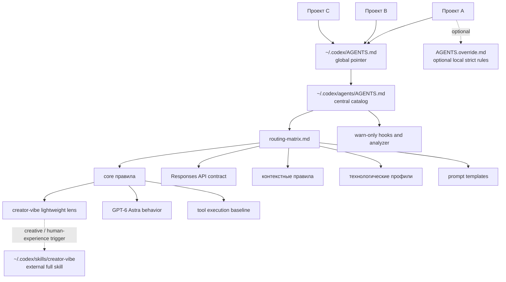

# Agents.md

**Централизованная система инструкций для AI-агентов разработки.**

Перестаньте копировать `AGENTS.md` в каждый репозиторий.

Вместо этого:

* храните инструкции для агентов **в одном месте**
* подключайте их из проектов
* обновляйте правила **один раз → применяются везде**

Проще говоря:

> `Agents.md` — это **`.editorconfig` для AI-агентов**.

---

# Зачем это нужно

При использовании AI-агентов (Codex, Cursor, Claude Code, Copilot и др.)
в проектах обычно появляется файл `AGENTS.md` с правилами работы:

* правила коммитов
* требования к тестам
* правила отладки
* архитектурные ограничения

Со временем возникает проблема:

```
один файл
в 10 репозиториях
с 10 разными версиями
```

Изменение правил превращается в боль.

Этот репозиторий решает проблему с помощью
**централизованного каталога инструкций для агентов**.

---

# Общая архитектура

Основная схема для Codex: один глобальный pointer в `~\.codex\AGENTS.md`
ссылается на центральный каталог `~\.codex\agents\AGENTS.md`.
Рабочие репозитории не дублируют инструкции: локально они добавляют только
`AGENTS.override.md`, если нужны дополнительные строгие правила.

То же правило распространяется на базовый шаблон спеки: canonical `_template.md`
живёт в центральном каталоге по отдельному пути `templates/specs/_template.md`,
а локальный `specs/` остаётся только каталогом рабочих спецификаций.


```mermaid
flowchart TD

CodexHome[~/.codex/AGENTS.md<br/>global pointer]
Central[~/.codex/agents/AGENTS.md<br/>central catalog]

RepoA[Проект A]
RepoB[Проект B]
RepoC[Проект C]
Override[AGENTS.override.md<br/>optional local strict rules]

Router[routing-matrix.md]

Core[core правила]
CreatorVibe[creator-vibe lightweight lens]
Model[GPT-6 Astra behavior]
ToolExecution[tool execution baseline]
Responses[Responses API contract]
Contexts[контекстные правила]
Profiles[технологические профили]
Prompts[prompt templates]
Operations[warn-only hooks and analyzer]
ExternalSkill[~/.codex/skills/creator-vibe<br/>external full skill]

CodexHome --> Central

RepoA --> CodexHome
RepoB --> CodexHome
RepoC --> CodexHome
RepoA -. optional .-> Override

Central --> Router

Router --> Core
Core --> CreatorVibe
Core --> Model
Core --> ToolExecution
CreatorVibe -. creative / human-experience trigger .-> ExternalSkill
Router --> Responses
Router --> Contexts
Router --> Profiles
Router --> Prompts
Central --> Operations
```

---

# Creator Vibe: lightweight lens и полный skill

Central stack применяет [creator-vibe-lens.md](instructions/core/creator-vibe-lens.md) до классификации каждой задачи. Линза помогает сохранить реальный человеческий outcome и авторский замысел, но не переопределяет explicit instructions, factual accuracy, safety, exact-output, authorization, scope, QUEST или более специфичные owners.

Полный [`bish-x/creator-vibe`](https://github.com/bish-x/creator-vibe) является внешним optional skill: он загружается только для задач, где результат зависит от taste, voice, feeling, UX/human experience или недосказанного намерения. Для factual, mechanical, exact-output и fully specified work полный skill не нужен. Если он не установлен, lightweight owner продолжает работать и не должен создавать ложный claim о загрузке skill.

Репозиторий не vendor-ит и не модифицирует upstream-текст. Воспроизводимая локальная интеграция проверена на commit [`58642d69fafc5768627ed16215723c19198c4b4b`](https://github.com/bish-x/creator-vibe/commit/58642d69fafc5768627ed16215723c19198c4b4b).

---

# Surface Contract Matrix для GPT-6 Astra

Каталог оптимизирован под `GPT-6 Astra`; workload-роли GPT-5.6 Sol/Terra/Luna сохранены. Baseline не переключает модели в пользовательской конфигурации. Перед model-sensitive validation фиксируйте фактическую поверхность, model ID, effort и версию клиента: доступность зависит от rollout, sign-in, клиента и account. Срез источников для этой матрицы проверен 2026-09-05; перед rollout перепроверяйте его.

| Поверхность | Текущий контракт | Как использовать каталог |
|---|---|---|
| Standard ChatGPT | Его picker и default проверяются отдельно; документация Work/Codex не устанавливает контракт обычного чата. | Применять общие behavior rules без переноса API model IDs или Work tiers в product UI. |
| ChatGPT Work / desktop, Codex CLI / IDE | Официальный model guide перечисляет Astra наряду с Sol/Terra/Luna; конкретные options зависят от доступа. Max увеличивает reasoning, Ultra использует subagents и не равен API pro mode. | Сохранять выбранную модель и начинать с доступного default effort. Для воспроизводимого Astra smoke задавать `gpt-6-astra` явно и проверять, что установленная версия клиента поддерживает модель. |
| Codex cloud | В прочитанной матрице доступности Astra для Codex cloud не заявлена. | Не выводить cloud availability из наличия Astra в local model list; проверять текущий cloud contract отдельно. |
| OpenAI API | `gpt-6-astra` имеет собственные ограничения efforts/tools/parameters; `gpt-5.6` остаётся family alias Sol, а не Astra. | По API-триггеру подключать [openai-responses-api.md](instructions/governance/openai-responses-api.md); не переносить product Ultra в API payload. |

Официальные источники: [ChatGPT Work и Codex models](https://learn.chatgpt.com/docs/models), [Using GPT-6 Astra](https://developers.openai.com/api/docs/guides/latest-model?model=gpt-6-astra), [Astra API model](https://developers.openai.com/api/docs/models/gpt-6-astra). Experimental context management и другие opt-in features автоматически не включаются.

---

# Структура репозитория

```
instructions/
 ├─ core/          # базовые правила и QUEST owner-документы
 ├─ contexts/      # контексты выполнения
 │   ├─ debug-dotnet-mcp-coreclr.md
 │   ├─ performance-optimization.md
 │   ├─ testing-dotnet.md
 │   ├─ testing-frontend.md
 │   └─ visual-feedback.md
 ├─ profiles/      # технологические и сценарные профили
 ├─ governance/    # routing, quality gate и политики каталога
 └─ onboarding/    # шаблоны подключения

prompts/           # канонические prompt templates для guided workflows
 ├─ business-process-automation/
 └─ storm/

schemas/           # JSON Schema для machine-readable workflow artifacts
scripts/           # validator, operational runtime и workflow scripts
 ├─ hooks/
 ├─ fixtures/agent-operations/
 └─ storm/
templates/
 ├─ codex/
 ├─ specs/
 │  └─ _template.md
 └─ storm/
specs/             # рабочие спецификации изменений каталога
```

---

# Канонические точки входа

Основные файлы системы:

* `AGENTS.md` — основная точка входа
* `instructions/governance/routing-matrix.md` — алгоритм маршрутизации инструкций
* `instructions/core/creator-vibe-lens.md` — обязательный lightweight owner intent/human outcome и trigger полного external skill
* `instructions/core/model-behavior-baseline.md` — owner optimization baseline `GPT-6 Astra`: outcome-first, surface-aware model guidance, ясный стиль и stop rules
* `instructions/core/tool-execution-baseline.md` — обязательный owner preflight, paths/globs, PowerShell, patch, Git и failure classification для tool-heavy задач
* `instructions/governance/openai-responses-api.md` — trigger-based owner wire-level контрактов OpenAI Responses API
* `instructions/core/quest-governance.md` — gate `SPEC → EXEC` для инженерных изменений
* `instructions/core/quest-mode.md` — owner фазового поведения `QUEST`
* `instructions/governance/review-loops.md` — обязательные auto-review loops после `SPEC` и `EXEC`
* `instructions/profiles/business-process-automation.md` — сценарный профиль для пошаговой автоматизации бизнес-процессов
* `instructions/profiles/storm-product-development.md` — сценарный профиль для STORM product workflow, BDD/Gherkin behavior layer и команд `/storm:*`

---

# Как работает маршрутизация инструкций

Точный алгоритм выбора документов, порядок сборки stack и модель разрешения конфликтов определены только в [instructions/governance/routing-matrix.md](instructions/governance/routing-matrix.md).

Короткий порядок работы:

1. Прочитать `AGENTS.md`
2. Открыть `routing-matrix.md`
3. Определить тип задачи:
   * `catalog-governance`
   * `consumer-onboarding`
   * `delivery-task`
   * `guided-artifact-workflow`
4. Собрать central stack по `routing-matrix.md`, включая `model-behavior-baseline` и, для tool-heavy задачи, `tool-execution-baseline`
5. Если в consumer-репозитории есть `AGENTS.override.md`, применить только его ужесточающие правила
6. Если задача идёт через `QUEST`, использовать:
   * [instructions/core/quest-governance.md](instructions/core/quest-governance.md) для applicability и quality gate
   * [instructions/core/quest-mode.md](instructions/core/quest-mode.md) для фазового поведения `SPEC` и `EXEC`

Важно:

* `SPEC gate` применяется к инженерным изменениям каталога, кода, инфраструктуры и канонических файлов проекта
* `model-behavior-baseline` применяется ко всем сценариям и задаёт Astra optimization contract: outcome-first цель, surface evidence, критерии успеха, ограничения, output contract и stop rules
* `tool-execution-baseline` применяется до первого значимого tool call и не занимает место task-specific context
* `openai-responses-api` подключается только для API-specific задач; ordinary Markdown review или работа в product UI не должны тянуть wire-level API правила
* на фазе `SPEC` рабочая spec в локальном `./specs/` может обновляться до подтверждения пользователя; остальные файлы менять нельзя
* внутри `QUEST` после черновика спеки обязателен цикл `draft → lint/rubric → post-review → refine`
* внутри `QUEST` после исполнения обязателен цикл `implement → test → post-review → fix/retest → report`
* если review находит uniquely best option, агент обязан выбрать его сам; пользователя спрашивают только при реальной неоднозначности
* guided workflow с пользовательскими артефактами может идти без `SPEC gate`, если агент не меняет канонические файлы
* STORM safe full-cycle может идти как guided workflow только без изменений tests/code/test annotations; любые такие изменения переводят задачу в `delivery-task` с `QUEST`
* STORM BDD/Gherkin команды `/storm:gherkin`, `/storm:bdd-sync`, `/storm:bdd-lint` и `/storm:bdd-conflicts` могут идти как artifact-only guided workflow; `/storm:bdd-implement ST-XXXX` всегда идёт как `delivery-task` через `QUEST`
* для аналитических задач без выраженного стека можно использовать сценарный профиль без `stack profile`

Примеры:

* инженерная задача по каталогу: `model-behavior-baseline + tool-execution-baseline + quest-governance + collaboration-baseline + governance overlays`
* пошаговый анализ бизнес-процесса: `model-behavior-baseline + collaboration-baseline + business-process-automation`
* STORM product discovery без code/test mutations: `model-behavior-baseline + collaboration-baseline + storm-product-development`
* STORM implementation/cleanup/test coverage: `model-behavior-baseline + quest-governance + collaboration-baseline + testing-baseline + stack/testing profile + storm-product-development`

---

# Operational prevention runtime

Каталог содержит versioned candidate механической защиты от повторяемых tool-ошибок:

* `scripts/hooks/agent-operations-hook.ps1` — fail-open dispatcher только для `PreToolUse` и `PostToolUse`, с physical-path lock, atomic rotation и проверяемым recovery marker для незавершённого rollback;
* `scripts/install-agent-operations.ps1` — idempotent preview/install/uninstall/prune и evidence-bound `-MarkActive` с physical-alias transaction lock, intermediate reparse guards, fingerprints, backup и rollback; runtime записывается из захваченного и хешированного byte snapshot;
* `scripts/probe-agent-operations-activation.ps1` — controlled safe/noisy/fail-open probe, проверка agent limits, manual hook trust, подтверждение controlled host task, install-bound runtime challenge и привязанное к fingerprint reviewer write-denial evidence; probe исполняет hash-verified captured runtime bytes из одноразового private staging path и повторно проверяет live runtime;
* `scripts/analyze-codex-session-errors.ps1` — потоковый privacy-safe отчёт с дедупликацией trace/call IDs, агрегацией child traces в root task, раздельными task/trace/event и envelope/matched/unmatched/boundary denominators и independently sampled private-local gold gate;
* `templates/codex/agents/independent-reviewer.toml` — read-only reviewer template;
* `templates/codex/local-environment/` — read-only Windows preflight для consumer rollout.

Проверка versioned candidate не меняет пользовательский Codex home:

```powershell
pwsh -File scripts/test-agent-operations.ps1
pwsh -File scripts/install-agent-operations.ps1 -CodexHome <fixture-path> -WhatIf
```

Telemetry включается только при наличии созданной installer-ом случайной salt в local manifest и пишет allowlist `schemaVersion/timestamp/runtimeVersion/eventName/category/severity/action/exitClass/repoHash` плюс optional `sessionHash`; raw command/output/path не сохраняются. Межпроцессный file lock сериализует lexical aliases одного physical logs directory. При невозможности откатить ротацию hook сохраняет checksum-bound recovery copies и marker; проверенный комплект после 7 дней проходит bounded quarantine cleanup, а malformed/drifted/partial-cleanup state остаётся для ручной проверки без ложного восстановления marker.

Фраза `Спеку подтверждаю` разрешает только repository implementation. Реальная установка в `%USERPROFILE%\.codex` допустима лишь после отдельного Git delivery, проверки active central checkout, предъявления exact `-WhatIf` proposal с `proposalHash` и фразы `Глобальную активацию подтверждаю` для этого hash. Preview раскрывает exact before/after content для `config.toml`, `hooks.json` и reviewer, immutable runtime hash и только явно перечисленные generated fields. После записи non-managed hooks остаются в состоянии `awaiting-trust`, пока пользователь не проверит exact definition через `/hooks` или актуальный документированный эквивалент, не подтвердит запуск controlled host task, probe не увидит install-bound runtime challenge и reviewer write denial, а отдельный approved `-MarkActive` не переведёт полный manifest postimage в `active`. Activation evidence действительно не более 15 минут и повторно проверяется непосредственно перед commit.

---

# Guided Workflows

Каталог поддерживает не только правила для инженерных изменений, но и готовые сценарии пошаговой аналитической работы.

Сейчас в репозитории есть канонические guided workflows:

* `business-process-automation`
* `storm-product-development`

Этот сценарий ведёт агента по цепочке:

1. синтетическое интервью с экспертом
2. моделирование `AS-IS`
3. анализ точек автоматизации
4. проектирование `TO-BE`
5. построение skill graph ИИ-агента

Шаблоны шагов лежат в `prompts/business-process-automation/`.
Если пользователь просит выдавать артефакты по шагам, агент должен сохранять каждый шаг отдельным файлом и ждать подтверждения перед продолжением.

## STORM Product Development

`storm-product-development` ведёт агента по циклу living product specification:

1. восстановить реализованные stories, constraints, tests и code units из текущего продукта;
2. построить traceability `story -> acceptance criteria -> tests -> code`;
3. сформировать Gherkin Rules/Scenarios как executable behavior examples;
4. вывести needs, Product Goal и Product Vision;
5. найти gaps, cloud conflicts и proposed backlog;
6. построить dependency-aware ranking;
7. провести process audit;
8. реализовывать отдельные stories через SDD/BDD только через `/storm:implement ST-XXXX` или `/storm:bdd-implement ST-XXXX`.

Канонический machine-readable artifact в consumer-репозитории:

```text
docs/product/storm.json
```

`.feature` files по умолчанию лежат в:

```text
features/
```

Если consumer-репозиторий использует другой root, он фиксируется в `metadata.feature_root` внутри `storm.json`.

Central assets:

```text
instructions/profiles/storm-product-development.md
prompts/storm/
templates/storm/
schemas/storm-artifacts.schema.json
scripts/storm/validate-artifacts.py
scripts/storm/rank-backlog.py
```

Примеры вызова:

```text
Используй central stack по AGENTS.md и routing-matrix.md, подключи профиль storm-product-development и выполни /storm:full-cycle.
Не меняй tests, code и test annotations.
```

```text
Используй central stack по AGENTS.md и routing-matrix.md, подключи профиль storm-product-development и выполни /storm:implement ST-0007.
```

```text
Используй central stack по AGENTS.md и routing-matrix.md, подключи профиль storm-product-development и выполни /storm:gherkin ST-0007.
```

```text
Используй central stack по AGENTS.md и routing-matrix.md, подключи профиль storm-product-development и выполни /storm:bdd-lint.
```

Проверка artifacts из consumer-репозитория:

```powershell
python <AGENTS_ROOT>\scripts\storm\validate-artifacts.py .\docs\product\storm.json
python <AGENTS_ROOT>\scripts\storm\rank-backlog.py .\docs\product\storm.json --out .\docs\product\reports\ranking.md
```

BDD/Gherkin слой в `storm.json` хранит metadata and traceability, а сами executable examples должны жить в `.feature` files. Acceptance criteria остаются обзорным readiness contract, Gherkin Rules/Scenarios делают их проверяемыми примерами, automated tests and step definitions исполняют эти примеры.

---

# Быстрый старт

## Основной способ: global pointer в Codex home

Для Codex подключите каталог один раз в `C:\Users\<user>\.codex\`.
Проверенная схема:

* центральный каталог доступен как `C:\Users\<user>\.codex\agents`
* `C:\Users\<user>\.codex\AGENTS.md` содержит короткий pointer на центральный `AGENTS.md`
* в рабочих репозиториях локальный `AGENTS.md` больше не нужен
* локальный `AGENTS.override.md` применяется только поверх central stack и может только ужесточать `MUST`
* для `QUEST` рабочие spec-файлы создаются в локальном `.\specs\`, а canonical template берётся из центрального `templates\specs\_template.md`
* lightweight `creator-vibe-lens` входит в central stack; полный external skill устанавливается отдельно и остаётся optional

### 1. Подключить каталог как `~\.codex\agents`

Если репозиторий уже клонирован в удобном месте, создайте junction:

```powershell
$codexHome = Join-Path $env:USERPROFILE ".codex"
$agentsRepo = "C:\path\to\Agents.md"

New-Item -ItemType Junction `
  -Path (Join-Path $codexHome "agents") `
  -Target $agentsRepo
```

Если удобнее хранить каталог прямо в Codex home:

```powershell
git clone https://github.com/Kibnet/Agents.md.git "$env:USERPROFILE\.codex\agents"
```

---

### 2. Создать глобальный pointer

Создайте `C:\Users\<user>\.codex\AGENTS.md`:

```
# AGENTS (global pointer)

Необходимо использовать центральный каталог инструкций:

- `C:\Users\<user>\.codex\agents\AGENTS.md`

Порядок применения:
1. Центральный `AGENTS.md` -> central stack
2. Локальный `AGENTS.override.md` -> дополнительные локальные инструкции поверх central stack; только ужесточение MUST

Для QUEST-задач:

- рабочие spec-файлы создаются в локальном `.\specs\` репозитория
- canonical template берется из `C:\Users\<user>\.codex\agents\templates\specs\_template.md`
```

### 3. Опционально установить полный `creator-vibe`

Lightweight owner уже входит в central catalog. Чтобы creative/human-experience задачи могли загрузить полный upstream skill, используйте системный `skill-installer` и pinned commit:

```powershell
python "$env:USERPROFILE\.codex\skills\.system\skill-installer\scripts\install-skill-from-github.py" `
  --repo bish-x/creator-vibe `
  --path . `
  --ref 58642d69fafc5768627ed16215723c19198c4b4b `
  --name creator-vibe
```

Installer не перезаписывает существующий destination. Новый skill становится доступен следующему Codex turn/session.

### 4. Добавлять только локальные ужесточения

В проектах создавайте `AGENTS.override.md` только если нужны дополнительные
локальные ограничения, команды или профиль по умолчанию. Central stack остаётся
источником правил, а override не заменяет центральный `AGENTS.md`.

## Альтернатива: pointer в конкретном репозитории

Для инструментов, которые не читают `~\.codex\AGENTS.md`, можно оставить
локальный pointer в репозитории-потребителе:

```
# AGENTS

Этот репозиторий использует центральный каталог инструкций:

- <AGENTS_ROOT>\AGENTS.md

Для QUEST-задач:

- рабочие spec-файлы создаются в локальном `.\specs\`
- canonical template всегда берётся из `<AGENTS_ROOT>\templates\specs\_template.md`
```

Где `<AGENTS_ROOT>` указывает на каталог с централизованными инструкциями,
например `$env:USERPROFILE\.codex\agents`.

---

# Локальные переопределения

Если проекту нужны дополнительные ограничения, можно создать:

```
AGENTS.override.md
```

В нём можно добавить **локальные правила**,
не дублируя весь набор инструкций.

---

# Проверка качества

Перед завершением изменений можно запустить валидацию:

```
pwsh -File scripts/validate-instructions.ps1
pwsh -File scripts/test-validate-instructions.ps1
pwsh -File scripts/test-agent-operations.ps1
```

---

# CI-валидация

В репозитории настроен workflow:

```
.github/workflows/validate-instructions.yml
```

Он проверяет инструкции при:

* `push`
* `pull request`

Catalog/link/semantic checks выполняются на `ubuntu-latest` без Windows-specific runtime suite. Полные hook/installer/analyzer/privacy contracts выполняются отдельным `windows-latest` job, где доступны NTFS junction/reparse semantics.

---

# Поддерживаемые AI-инструменты

Каталог рассчитан на использование с агентами, которые читают `AGENTS.md`, например:

* Codex CLI
* Cursor
* Claude Code
* GitHub Copilot Agents
* Windsurf

---

# Философия проекта

Цели:

* единый каталог инструкций для AI-агентов
* повторное использование правил между репозиториями
* единый инженерный workflow
* версионирование и управление правилами

---

# Участие в развитии

Приветствуются улучшения:

* алгоритма маршрутизации
* технологических профилей
* контекстных инструкций
* скриптов валидации

---

# Лицензия

MIT
